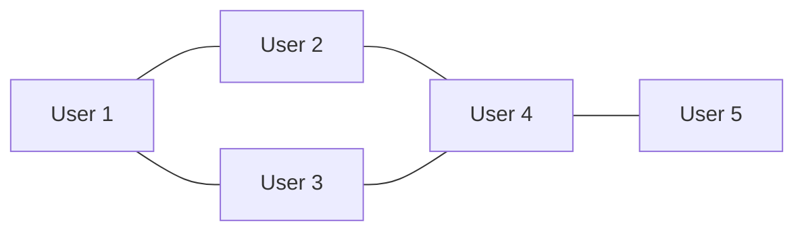
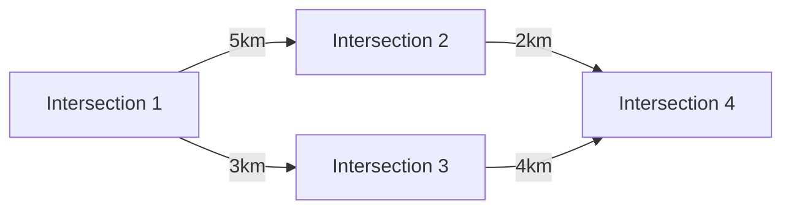
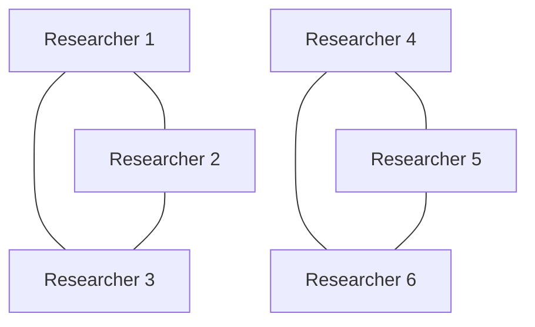
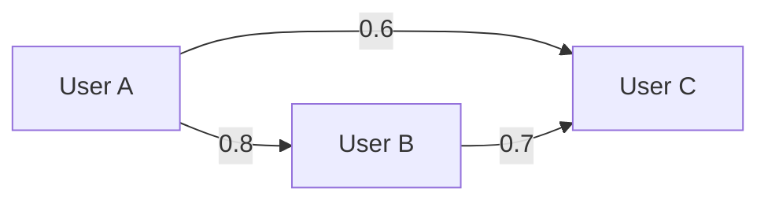
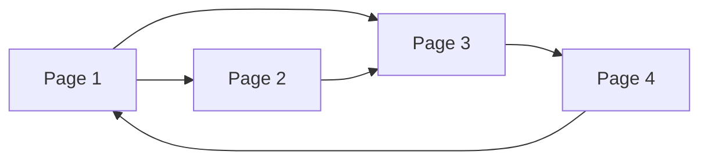
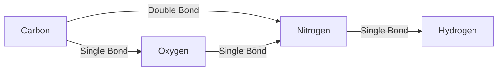

 

>This section is made for who already know about basic idea about machine learning and deep learning. We'll discuss about GNN with concept of CNN, ResNet, LSTM, Reinforcement learing, Attention mechanism.
 
>
>Our goal is making bird's eye view about GNN and describe it intuitively from idea into math.

 

# What is the Graph Neural Network

 

> GNN(Graph Neural Network) is the Nueral Netwrok that is based on the graph.

 

Most of us already know about what means graph. 
But, does we really  know about graph data structure? 
 

What kind of data really graph represents well?
I'll show you some examples and explain how to analysis graph data structure in mathematics.
 

## Example of Graph structed data 

 

### Social network
 

 

- **Description**: Users are nodes, and friendships/connections are edges.
    
- **Graph Theory**:
    
    - **Algebraic**: Adjacency matrices model connections.
        
    - **Probabilistic**: Models uncertainties (e.g., friend recommendations).
        
- **Math**: Adjacency matrix $A$ where $A_{ij}=1$ 
		if users $ii$ and $jj$ are connected.
 

### Road network
 

 

- **Description**: Intersections are nodes, and roads are edges with weights (e.g., distance).
    
- **Graph Theory**:
    
    - **Geometric**: Spatial coordinates define node positions.
        
    - **Algebraic**: Weighted adjacency matrices optimize routes.
        
- **Math**: Edge weights $W_{ij}=dist(i,j)$.
 

### Identifying key research groups
 

 

- **Description**: Researchers are nodes; co-authorships are edges.
    
- **Graph Theory**:
    
    - **Algebraic**: Laplacian matrices detect communities.
        
    - **Extremal**: Finds influential clusters.
        
- **Math**: Laplacian $L=D−A$, where $D$ is the degree matrix.
 

### Finding similar users or products
 

 

- **Description**: Users/products are nodes; edges represent similarity.
    
- **Graph Theory**:
    
    - **Probabilistic**: Models uncertain similarities.
        
    - **Algebraic**: Matrix factorization for recommendations.
        
- **Math**: Cosine similarity $sim(i,j)=\frac{vi⋅vj}{∥vi∥∥vj∥}​$
 

### Google search ranking (PageRank)
 

 

- **Description**: Web pages are nodes; hyperlinks are directed edges.
    
- **Graph Theory**:
    
    - **Algebraic**: Eigenvector centrality via Markov chains.
        
- **Math**: PageRank vector
			**$p=αAp+(1−α)vp=αAp+(1−α)v$**
 

### Drug discovery
 

 

- **Description**: Atoms are nodes; chemical bonds are edges.
    
- **Graph Theory**:
    
    - **Topological**: Analyzes molecular structure.
        
    - **Geometric**: 3D conformation for binding.
        
- **Math**: Graph isomorphism checks $G1≅G2$
 

# Why Graph can represents those kind of data?

 

Graph theory can interpret into 5 kinds of method

 

>#### 1. Algebraic graph theory
> #### 2. Geometric graph theory
> #### 3. Extremal graph theory
> #### 4. Probabilistic graph theory
> #### 5.  Topological graph theory

