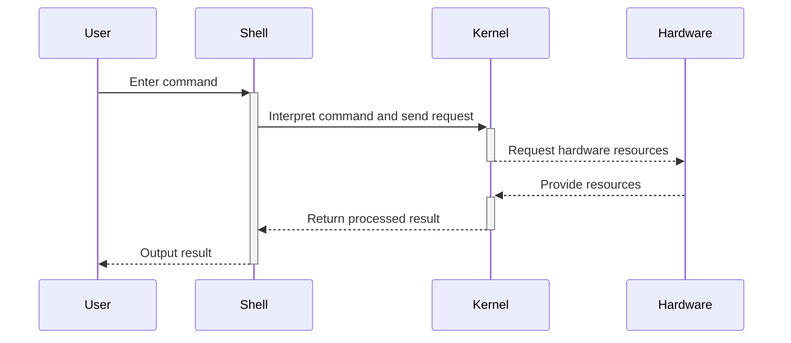

---  

marp: true
paginate: true  
footer: '**Kang - Minkyu** | [perelman@unist.ac.kr](mailto:perelman@unist.ac.kr)'  
  
---

# **Special Section**  
  
## &nbsp; Introduction to Linux with Operating System  

---
# **Index** 

 **1. What is Linux**
**2. Why we have to study Linux**
**3. Concept of kernel and Shell**
**4. How to use Linux**
  
---  
  
# **What is Linux**  
  
  
  
> **Linux** is the sort of **operating system** using **Linux kernel** or **Linux kernel** itself  
  
  
- The name of Linux comes from the **Linus' \*nix**, it means **unix of linus**  
**\*nix** means about Unix, thus it shows that **Linux** is **Unix derived operating system**  
  
- **Linux** is the **open source operating system**, and many developer uses Linux based customized OS  
  
- **Linux** are used on **Cloud computing, Embedded system, Research areas**  
  
  
---  
  
# **Why We have to study Linux**  
  
> Studying about **Linux is highly difficult** work, but **it is worthy**  
  
- **Deep Understanding Operating System**  
  
- **High flexibility and customizability**  
  
- **Hardware portability and dependency**  
  
---  
  
# **Concept of kernel and Shell**  
  
> **Kernel** is **OS** itself, and **Shell** is **the function that uses OS easily**  
  
- **Kernel** gives **interface between hardware and application program**  
and **handle the computer resource**  
  
- **Shell** covers **kernel**, it gets **the user input and process output with system**  
  
- **Shell** connects between **User and Linux**  
  
  
---  
  
# **Concept of kernel and Shell**  
  
  

    

---

# **How to use Linux**  

---