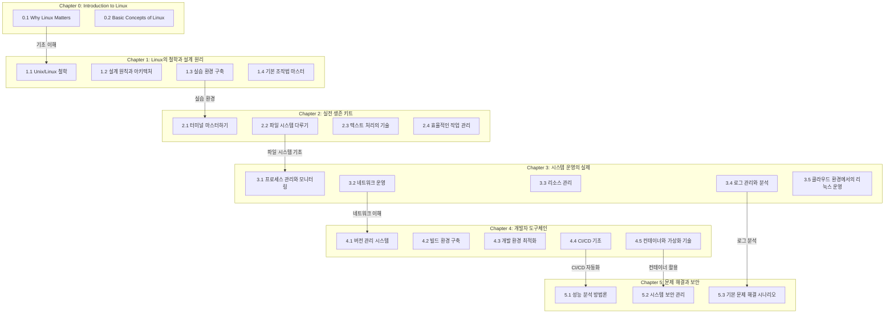

## Chapter 0: Introduction to Linux (간소화)
0.1. Why Linux Matters  
0.2. Basic Concepts of Linux  

## Chapter 1: Linux의 철학과 설계 원리
1.1. Unix/Linux 철학  
1.2. 설계 원칙과 아키텍처  
1.3. 실습 환경 구축  
1.4. 기본 조작법 마스터  

## Chapter 2: 실전 생존 키트
2.1. 터미널 마스터하기  
2.2. 파일 시스템 다루기  
2.3. 텍스트 처리의 기술  
2.4. 효율적인 작업 관리  

## Chapter 3: 시스템 운영의 실제
3.1. 프로세스 관리와 모니터링  
3.2. 네트워크 운영  
3.3. 리소스 관리  
3.4. 로그 관리와 분석  
3.5. 클라우드 환경에서의 리눅스 운영  

## Chapter 4: 개발자 도구체인
4.1. 버전 관리 시스템  
4.2. 빌드 환경 구축  
4.3. 개발 환경 최적화  
4.4. CI/CD 기초  
4.5. 컨테이너와 가상화 기술  

## Chapter 5: 문제 해결과 보안
5.1. 성능 분석 방법론  
5.2. 시스템 보안 관리  
5.3. 기본 문제 해결 시나리오  

